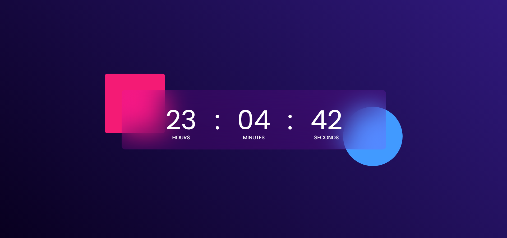

# Digital Clock with Glass Morphism Effect



A modern, responsive digital clock with glass morphism UI design. This clock displays hours, minutes, and seconds in real-time with smooth animations.

### Live demo : https://iamarpisaha.github.io/digital-clock/

## Features

- 🕒 Real-time updating digital clock
- 🖥️ Responsive design for all screen sizes
- ✨ Glass morphism UI effect
- 🌈 Subtle hover animations
- ⚡ Optimized performance with minimal JavaScript
- 🔄 Seconds pulse animation for visual feedback

## Technologies Used

- HTML5
- CSS3 (with modern features like backdrop-filter)
- JavaScript (ES6)

## Installation

No installation required! Simply:

1. Clone this repository or download the files
2. Open `index.html` in your web browser

```bash
git clone https://github.com/your-username/digital-clock.git
cd digital-clock
```

## Files Structure

digital-clock/
├── index.html # Main HTML file
├── style.css # CSS styles with glass morphism effects
├── script.js # JavaScript for clock functionality
└── README.md # This file

## Customization

**You can easily customize the clock by modifying:**

- Colors in style.css (change the gradient background)
- Font sizes in the media queries for different screen sizes
- Animation effects (edit or remove the pulse animation)
- Glass effect intensity (adjust the backdrop-filter values)

## Browser Support

The clock works on all modern browsers including:

- Chrome
- Firefox
- Safari
- Edge

Note: The glass morphism effect may not appear correctly on some older browsers that don't support backdrop-filter.

## License

This project is open source and available under the MIT License.

Made with ❤️ by Arpi Saha
